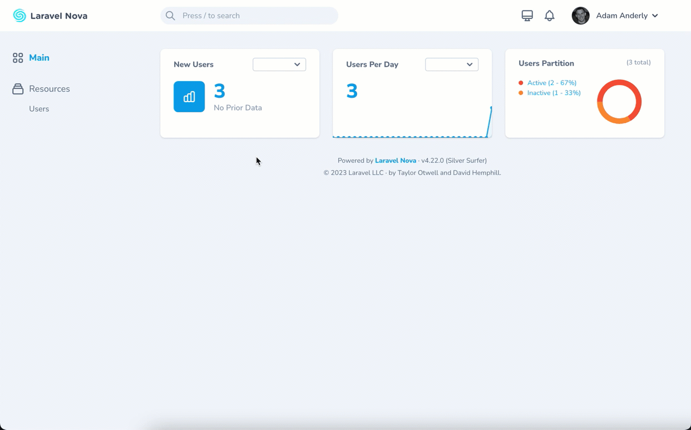

# Nova Linkable Metrics

[](https://packagist.org/packages/saintsystems/nova-linkable-metrics)
[](https://packagist.org/packages/saintsystems/nova-linkable-metrics)

Add custom router-links to your Laravel Nova metrics.



## Installation

You can install the package in to a Laravel app that uses [Nova](https://nova.laravel.com) via composer:

```bash
composer require saintsystems/nova-linkable-metrics
```

## Usage

To add the link ability to your Laravel Nova metric cards, you need to add the `Linkable` traits to your metrics.

For example, within your custom Nova value metric card:
```php
// in your Nova value metric card class:
import SaintSystems\Nova\LinkableMetrics\LinkableValue;

use LinkableValue;

```

Within your custom Nova trend metric card:
```php
// in your Nova value metric card class:
import SaintSystems\Nova\LinkableMetrics\LinkableTrend;

use LinkableTrend;

```

Within your custom Nova trend partition card:
```php
// in your Nova value metric card class:
import SaintSystems\Nova\LinkableMetrics\LinkablePartition;

use LinkablePartition;

```

## Defining Metric Links

You can define metric links using the `route` method from the `Linkable` trait in one of two ways:

1. When the card is registered:
```php
    // NovaServiceProvider.php

    /**
     * Get the cards that should be displayed on the Nova dashboard.
     *
     * @return array
     */
    protected function cards()
    {
        return [
            (new JobsInProgress)->width('1/3')->route('index', ['resourceName' => 'jobs']),`
        ];
    }
```
2. Or, within the card itself (useful for cards only available on detail screens where you might want to filter the url based on the current resource):

```php
    // In your linktable Nova metric class

    /**
     * Calculate the value of the metric.
     *
     * @param  \Illuminate\Http\Request  $request
     * @return mixed
     */
    public function calculate(Request $request, UnitOfMeasure $unitOfMeasure)
    {
        $result = $this->result($unitOfMeasure->items()->count());
        $params = ['resourceName' => 'items'];
        $query = [
            'viaResource' => $request->resource,
            'viaResourceId' => $unitOfMeasure->id,
            'viaRelationship' => 'items',
            'relationshipType' => 'hasMany',
        ];
        return $result->route('index', $params, $query);
    }
```

## Credits

- [Adam Anderly](https://github.com/anderly)
- [Saint Systems](https://github.com/saintsystems)
- [All Contributors](../../contributors)

## License

The MIT License (MIT). Please see [License File](LICENSE.md) for more information.
